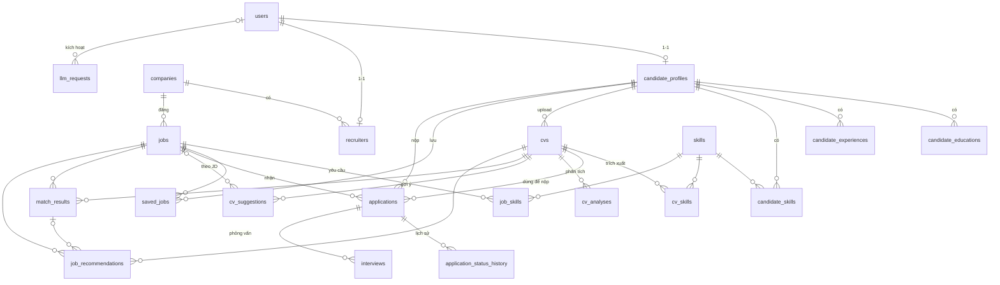

# Thiết kế cơ sở dữ liệu

DDL đầy đủ (kiểu dữ liệu, ràng buộc, index) nằm ở [database/schema.sql](../database/schema.sql). Tài liệu này giải thích các bảng và lý do thiết kế. Nguồn chính khi triển khai vẫn là Django migrations; hãy dùng `db_table` trong `Meta` để tên bảng khớp với thiết kế.

- **PostgreSQL**: toàn bộ dữ liệu quan hệ và kết quả AI.
- **ChromaDB**: chỉ chứa embedding của CV và Job. Document id trong ChromaDB trùng với `cvs.id` / `jobs.id`.

## 1. Quy ước chung

| Quy ước | Lý do |
|---|---|
| Bảng nghiệp vụ dùng khóa **UUID** | Không đoán được id qua URL; dễ đồng bộ với ChromaDB. |
| Bảng danh mục, bảng nối, bảng log dùng **BIGINT identity** | Nhỏ gọn, không lộ ra ngoài API. |
| Enum = `VARCHAR` + `CHECK` | Tương ứng `TextChoices` của Django; thêm giá trị mới không cần `ALTER TYPE`. |
| Xóa mềm bằng `deleted_at` ở `users`, `companies`, `jobs`, `cvs` | Giữ lịch sử ứng tuyển và kết quả AI khi người dùng "xóa". |
| Output của AI lưu dạng **JSONB** | Cấu trúc output thay đổi theo prompt version mà không phải migrate. Phần cần lọc/sắp xếp (điểm số) vẫn là cột riêng. |
| Mọi bảng có `created_at`; bảng được sửa có thêm `updated_at` | Audit và phát hiện dữ liệu cần index lại. |

## 2. Sơ đồ quan hệ (ERD)

Sơ đồ bỏ qua `industries` và `locations` cho gọn.

## 3. Các bảng theo module

### catalog: danh mục dùng chung

Đây là **app mới** `apps/catalog`. Kỹ năng được dùng bởi cả `candidates`, `cvs` và `jobs`. Nếu đặt trong một app nghiệp vụ, các app còn lại sẽ phụ thuộc chéo vào nó.

| Bảng | Mục đích |
|---|---|
| `skills` | Danh mục kỹ năng chuẩn hóa. `aliases` gom các cách viết khác nhau ("ReactJS", "React.js") về một kỹ năng. Kỹ năng do AI tự phát hiện có `is_verified = false` để admin duyệt. |
| `industries` | Ngành nghề, có thể phân cấp (`parent_id`). |
| `locations` | Tỉnh/thành phố. |

Tách kỹ năng thành danh mục là điều kiện để matching chính xác. Nếu không chuẩn hóa, "Python" trong CV và "python3" trong JD sẽ không khớp nhau khi so sánh bằng SQL.

### accounts

| Bảng | Mục đích |
|---|---|
| `users` | Custom user, đăng nhập bằng email (unique, không phân biệt hoa thường). `role` = candidate / employer / admin. |

Các bảng phụ do Django và thư viện tự sinh: `users_groups`, `users_user_permissions`, `token_blacklist_*` (simplejwt). Token xác thực email và reset mật khẩu dùng signed token nên không cần bảng.

### candidates

| Bảng | Mục đích |
|---|---|
| `candidate_profiles` | Hồ sơ 1-1 với `users`. Gồm thông tin cá nhân, level hiện tại, mong muốn (vị trí, lương, hình thức làm việc). `is_public` cho phép nhà tuyển dụng tìm thấy ứng viên chưa nộp đơn (talent pool). |
| `candidate_preferred_locations` | Các tỉnh/thành ứng viên muốn làm việc (n-n). |
| `candidate_educations` | Học vấn. |
| `candidate_experiences` | Kinh nghiệm làm việc. |
| `candidate_skills` | Kỹ năng ứng viên **tự khai**. |
| `saved_jobs` | Job đã lưu. |

### employers

| Bảng | Mục đích |
|---|---|
| `companies` | Thông tin công ty. `verification_status` để admin xác minh qua mã số thuế trước khi cho đăng tin. |
| `recruiters` | Liên kết user (role = employer) với công ty. `company_role` (owner/admin/member) phân quyền trong công ty; `status` dùng khi chủ công ty duyệt thành viên. |

### cvs

| Bảng | Mục đích |
|---|---|
| `cvs` | File CV và kết quả parse. Gồm `raw_text` (text thô), `parsed_data` (JSON có cấu trúc) và `file_hash` (SHA-256, dùng phát hiện trùng và làm khóa cache AI). Một ứng viên có nhiều CV nhưng tối đa một CV `is_default` (partial unique index). |
| `cv_skills` | Kỹ năng **trích xuất từ CV** (nguồn `nlp` / `llm` / `manual`) kèm độ tin cậy, đã map về `skills`. |

Hai điểm cần lưu ý:
- `candidate_skills` (tự khai) và `cv_skills` (trích xuất) được tách riêng vì độ tin cậy khác nhau. Mỗi CV cũng có thể nhấn mạnh một bộ kỹ năng khác nhau.
- **CV không sửa tại chỗ.** Upload lại thì tạo bản ghi mới. Nhờ vậy CV mà nhà tuyển dụng thấy trong một application luôn đúng với bản ứng viên đã nộp.

### jobs

| Bảng | Mục đích |
|---|---|
| `jobs` | Tin tuyển dụng gồm mô tả, yêu cầu, lương, level, hình thức làm việc và trạng thái (draft → published → paused / closed / expired). `search_vector` phục vụ full-text search. `application_count` là cột denormalized để hiển thị nhanh. |
| `job_skills` | Kỹ năng job yêu cầu. Có `is_required` (bắt buộc hay nice-to-have) và `weight` (trọng số khi chấm điểm matching). |

### applications (ATS)

| Bảng | Mục đích |
|---|---|
| `applications` | Đơn ứng tuyển (job, ứng viên, CV đã dùng). `UNIQUE (job_id, candidate_id)` chống nộp trùng. `status` đi theo pipeline: applied → screening → interview → offer → hired / rejected, và ứng viên có thể withdrawn. |
| `application_status_history` | Mỗi lần đổi trạng thái ghi một dòng: ai đổi, từ trạng thái nào sang trạng thái nào, ghi chú. Dùng cho timeline và thống kê thời gian tuyển. |
| `interviews` | Lịch phỏng vấn theo vòng, người phỏng vấn, kết quả và đánh giá. |

### ai

| Bảng | Chức năng | Mục đích |
|---|---|---|
| `cv_analyses` | CV analysis | Điểm tổng (0–100), điểm từng phần, điểm mạnh/yếu, tóm tắt. |
| `cv_suggestions` | CV suggestion | Danh sách gợi ý sửa CV. `job_id = NULL` là gợi ý tổng quát; có `job_id` là gợi ý để CV khớp một JD cụ thể. |
| `match_results` | Candidate matching + Job recommendation | Điểm khớp của **một cặp (CV, Job)**: điểm vector, điểm LLM, chi tiết theo tiêu chí, kỹ năng khớp/thiếu, giải thích. |
| `job_recommendations` | Job recommendation | Danh sách job gợi ý cho một CV (rank, lý do) và phản hồi của ứng viên (viewed / saved / applied / dismissed). |
| `llm_requests` | Tất cả | Log mỗi lời gọi LLM/embedding: token, chi phí, độ trễ, lỗi, người kích hoạt. |

Mỗi bảng kết quả AI có chung bộ cột theo dõi:
- `status`: pending / processing / completed / failed. Frontend polling cột này vì LLM chạy qua Celery.
- `provider`, `model_name`, `prompt_version`: biết kết quả được sinh bởi model nào, prompt nào, để so sánh khi đổi prompt.
- `input_hash`: SHA-256 của (dữ liệu đầu vào + prompt version + model). Nếu đã có kết quả cùng hash thì dùng lại, **không gọi LLM lần nữa**.
- `task_id`, `error_message`: theo dõi và debug Celery task.

Candidate matching và job recommendation dùng chung bảng `match_results` vì cả hai đều là "CV này khớp Job kia bao nhiêu". Mỗi cặp chỉ chấm một lần. Nhà tuyển dụng xem theo `job_id`, ứng viên xem theo `cv_id`. Điều này giảm đáng kể chi phí LLM.

## 4. Luồng dữ liệu của 4 chức năng AI

**Xử lý chung khi upload CV:**
`cvs` (pending) → Celery parse PDF/DOCX → ghi `raw_text`, `parsed_data`, `cv_skills` → tạo embedding và đưa vào ChromaDB → cập nhật `vector_indexed_at`.

**CV analysis:**
Đọc `cvs.parsed_data` → tính `input_hash` → nếu đã có `cv_analyses` completed cùng hash thì trả về luôn → nếu chưa thì gọi LLM, ghi `cv_analyses` và `llm_requests`.

**CV suggestion:**
Đọc CV, kết quả `cv_analyses` gần nhất và JD (nếu có) → gọi LLM → ghi `cv_suggestions`.

**Job recommendation:**
1. Lọc cứng bằng SQL: job đang published, chưa hết hạn, đúng địa điểm/level mong muốn.
2. Lọc nhanh bằng vector: hỏi ChromaDB top-K job gần với embedding của CV, lấy `vector_score`.
3. Rerank: lấy hoặc tạo `match_results` cho top-K cặp (LLM chấm, có cache).
4. Ghi `job_recommendations` theo thứ tự `final_score`.

**Candidate matching:**
Với một job, lấy CV của các application (hoặc CV public trong talent pool) → làm tương tự bước 2–3 → nhà tuyển dụng xem danh sách ứng viên sắp xếp theo `match_results.overall_score`.

## 5. Chính sách xóa

| Thao tác | Hành vi |
|---|---|
| Xóa user, company, job, CV | **Xóa mềm** (`deleted_at`), ẩn khỏi API. |
| Xóa job hoặc CV đã có application | Bị chặn ở DB (`ON DELETE RESTRICT`), nên chỉ xóa mềm được. |
| Xóa vĩnh viễn ứng viên (yêu cầu xóa dữ liệu) | `CASCADE`: hồ sơ, CV, application và kết quả AI bị xóa theo. |
| Xóa user là người thao tác (recruiter, admin) | `SET NULL` ở các cột `created_by`, `changed_by`, `interviewer_id`, nên lịch sử vẫn còn. |
| Xóa CV hoặc job (vĩnh viễn) | Kết quả AI liên quan bị `CASCADE`. Service cũng phải xóa document tương ứng trong ChromaDB. |

## 6. Đồng bộ ChromaDB

- Hai collection: `cvs` và `jobs`. Document id là UUID của bản ghi trong Postgres.
- Metadata lưu trong ChromaDB (`location_id`, `level`, `job_type`, `status`) để lọc ngay khi tìm vector.
- Postgres lưu `vector_model` và `vector_indexed_at`:
  - `updated_at > vector_indexed_at`: cần index lại.
  - `vector_model` khác model đang dùng: cần index lại toàn bộ.
- Job chuyển sang closed hoặc bị xóa thì xóa hoặc đánh dấu document trong ChromaDB (`vectorstore/indexer.py`).

## 7. Index quan trọng

| Index | Phục vụ |
|---|---|
| `uq_users_email` trên `lower(email)` | Đăng nhập, chống trùng email khác hoa thường. |
| `idx_jobs_public_list`, `idx_jobs_filter` (partial: published, chưa xóa) | Trang danh sách và bộ lọc job. |
| `idx_jobs_search` (GIN trên `search_vector`) | Tìm kiếm job theo từ khóa. |
| `idx_*_skills_skill` | Tìm CV/job/ứng viên theo kỹ năng. |
| `idx_applications_job_status` | Bảng kanban ATS của nhà tuyển dụng. |
| `idx_match_job_score`, `idx_match_cv_score` | Xếp hạng ứng viên và gợi ý job. |
| `idx_*_hash` | Tra cache kết quả AI. |
| `idx_llm_requests_user` | Đếm lượt dùng AI để giới hạn quota mỗi user. |

## 8. Ghi chú khi viết Django models

- Thêm app `apps/catalog` (skills, industries, locations) vào `INSTALLED_APPS`. Các app khác tham chiếu bằng chuỗi `"catalog.Skill"`.
- `saved_jobs` thuộc app `candidates` nhưng tham chiếu `jobs`. Dùng `"jobs.Job"` dạng chuỗi; không tạo vòng phụ thuộc vì `jobs` không import `candidates`.
- Partial unique index (`uq_cvs_default`) dùng `UniqueConstraint(fields=[...], condition=Q(...))`.
- `search_vector` dùng `SearchVectorField` cùng `GinIndex`. Với tiếng Việt, dùng config `simple` kết hợp extension `unaccent`.
- Các `CHECK` trên điểm số và khoảng lương khai báo bằng `CheckConstraint` để ràng buộc nằm ở cả tầng DB.
- Bảng nối có thuộc tính (`candidate_skills`, `cv_skills`, `job_skills`) viết thành model riêng, dùng làm `through` của ManyToMany.
