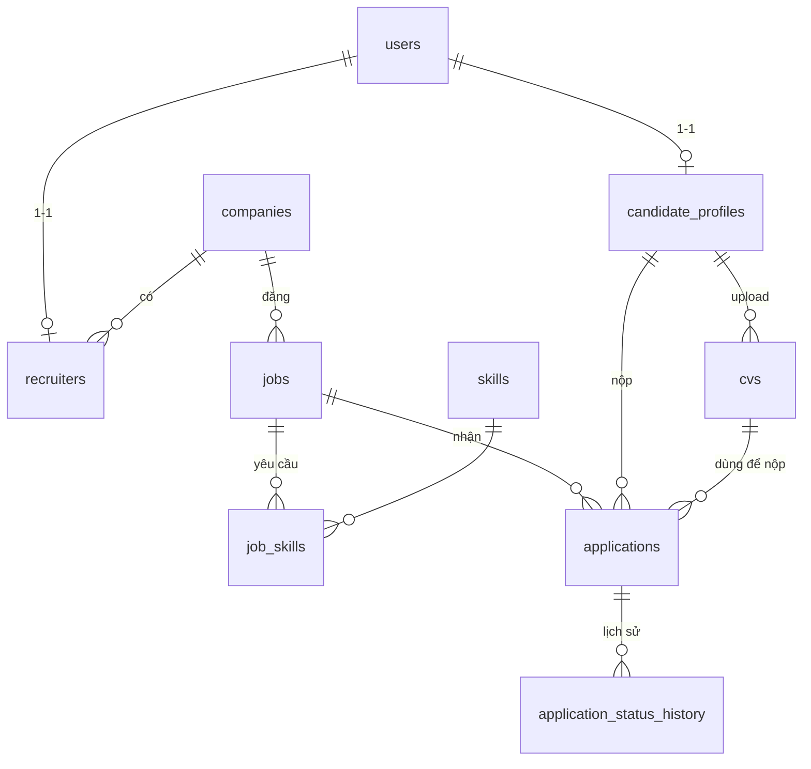

# Giai đoạn 1 — Backend API cho Nhà tuyển dụng

Tài liệu mô tả phần đã triển khai ở giai đoạn 1: chức năng dành cho **Nhà tuyển dụng (Employer)**, chưa có AI.
Tài liệu API chi tiết (tự sinh từ code): chạy server rồi mở `http://localhost:8000/api/docs/`.

## 1. Giả định

Các giả định dưới đây được đặt ra trước khi thiết kế. Nếu nhóm thống nhất khác, chỉ cần sửa ở đúng module liên quan.

| # | Giả định | Ảnh hưởng |
|---|---|---|
| 1 | Giữ nguyên stack và cấu trúc đã thống nhất trong `docs/backend-structure.md` và thiết kế DB trong `docs/database-design.md`: Django + DRF, PostgreSQL, mỗi nghiệp vụ một app, luồng `views → serializers → services/selectors → models`. Chọn **Django 5.2 LTS**, Python 3.12. | — |
| 2 | Nhà tuyển dụng = `User(role=employer)` gắn với **một** công ty qua bảng `recruiters`. Đăng ký tạo cùng lúc User + Company + Recruiter (owner, đang hoạt động). | `employers.services.register_employer` |
| 3 | Mọi recruiter đang hoạt động của công ty đều quản lý được **toàn bộ** tin và hồ sơ của công ty. Chỉ `owner`/`admin` được sửa hồ sơ công ty. Mời / duyệt thêm thành viên công ty chưa làm. | `employers.permissions` |
| 4 | Xác minh công ty do admin làm trong Django Admin. Mặc định **không** bắt buộc xác minh mới được đăng tin (để dev/demo thuận tiện); bật `EMPLOYER_REQUIRE_VERIFIED_COMPANY=True` để áp dụng đúng quy tắc trong thiết kế DB. | `jobs.services._ensure_publishable` |
| 5 | Ứng viên / CV / hồ sơ ứng tuyển chỉ có **model tối thiểu** để nhà tuyển dụng xem và xử lý. Không có API phía ứng viên (đăng ký ứng viên, upload CV, nộp đơn). Dữ liệu ứng viên mẫu tạo bằng `seed_demo`, đi qua đúng service `submit_application` mà API ứng viên giai đoạn sau sẽ gọi. | `apps/candidates`, `apps/cvs` |
| 6 | Có thêm API **công khai chỉ đọc** `GET /jobs/`, `GET /jobs/{id}/` ở mức tối thiểu để tin đã đăng hiển thị trên trang chủ / trang việc làm của frontend (nhà tuyển dụng xem trước tin). Không làm full-text search hay gợi ý. | `jobs.views.PublicJobViewSet` |
| 7 | Lương lưu theo **VND** (số nguyên) như thiết kế DB. Frontend nhập / hiển thị theo "triệu" và quy đổi ở tầng API (`src/api/adapters.js`). | — |
| 8 | Trạng thái tin: `draft → published ⇄ paused → closed` (tin đã đóng có thể mở lại). `expired` là trạng thái **suy ra** (đang tuyển nhưng quá hạn nộp), không cần cron. | `jobs/workflow.py` |
| 9 | Pipeline hồ sơ theo thiết kế DB: `applied → screening → interview → offer → hired`, bước nào cũng có thể `rejected`; `withdrawn` do ứng viên. Frontend chuyển sang dùng đúng bộ trạng thái này (thay cho `pending/reviewing/shortlisted` của bản mock cũ). | `applications/workflow.py` |
| 10 | Xóa tin là **xóa mềm**; tin đã có hồ sơ ứng tuyển thì không cho xóa (chỉ đóng) để không mất dấu ứng viên. | `jobs.services.delete_job` |
| 11 | CV là dữ liệu cá nhân: lưu ở thư mục riêng tư, **không** có URL công khai, chỉ tải qua API có kiểm tra quyền. Logo công ty là file công khai. | `common/storage.py` |
| 12 | Chưa gửi email: không có xác thực email, quên mật khẩu. | Giai đoạn sau |
| 13 | Frontend giữ chế độ mock (demo đầy đủ kể cả AI giả lập). Khi `VITE_USE_MOCK=false`, phần nhà tuyển dụng và trang việc làm công khai gọi API thật; tính năng AI và phía ứng viên **được ẩn** bằng feature flag cho tới khi backend hỗ trợ. | `src/utils/constants.js` |
| 14 | PostgreSQL là DB chính; hỗ trợ thêm SQLite (`DB_ENGINE=sqlite`) để chạy nhanh và để test. Giai đoạn này không dùng tính năng chỉ có ở PostgreSQL (ArrayField, tsvector) để chạy được trên cả hai. | `config/settings` |

## 2. Phạm vi

**Đã làm**

- Xác thực JWT: đăng nhập, refresh (xoay vòng token), đăng xuất (thu hồi token), đổi mật khẩu (thu hồi mọi phiên cũ), `me`.
- Đăng ký nhà tuyển dụng; hồ sơ cá nhân recruiter; hồ sơ công ty (kèm logo, trạng thái xác minh).
- Tin tuyển dụng: tạo (lưu nháp / đăng ngay), sửa, xem, xóa mềm, đăng / tạm dừng / đóng / mở lại; danh sách có lọc, tìm kiếm, sắp xếp, phân trang, đếm hồ sơ.
- Ứng viên: danh sách hồ sơ theo tin / trạng thái / từ khóa, chi tiết (ứng viên, CV, thư giới thiệu, lịch sử), chuyển trạng thái theo pipeline có ghi chú và lý do từ chối, chấm sao, xem / tải CV.
- Dashboard thống kê; danh mục tỉnh/thành, ngành nghề, kỹ năng; Django Admin (xác minh công ty, duyệt kỹ năng).
- Frontend: kết nối toàn bộ khu vực nhà tuyển dụng với API thật, thêm trang Hồ sơ công ty và Tài khoản.

**Không làm (theo yêu cầu)**: mọi chức năng AI/LLM — phân tích, chấm điểm CV, gợi ý việc làm, xếp hạng / tìm kiếm ứng viên bằng AI.

**Để giai đoạn sau**: API phía ứng viên, lịch phỏng vấn (`interviews`), mời thành viên công ty, email, module `apps/ai`.

## 3. Kiến trúc

```text
config/            settings (base/dev/prod/test), urls, api_urls (/api/v1/)
common/            model gốc (UUID, timestamps, xóa mềm), exception handler, phân trang,
                   RolePermission, storage riêng tư, tiện ích — không import từ apps
apps/
  accounts/        User, JWT, me, đổi mật khẩu; registry.py: điểm mở rộng hồ sơ theo vai trò
  catalog/  (mới)  Location, Industry, Skill + bộ giá trị dùng chung (JobType, WorkMode, JobLevel)
  employers/       Company, Recruiter, đăng ký NTD, quyền IsEmployer / CanManageCompany
  candidates/      CandidateProfile (tối thiểu)
  cvs/             CV (file riêng tư)
  jobs/            Job, JobSkill, workflow.py (trạng thái), signals.py (domain event)
  applications/    Application, lịch sử trạng thái, workflow.py (pipeline), dashboard, seed_demo
  ai/              (chưa cài vào INSTALLED_APPS — giai đoạn sau)
```

Phụ thuộc một chiều: `accounts ← catalog ← employers ← jobs ← applications`, `candidates ← cvs ← applications`.
`accounts` không import app nào: app của từng vai trò tự đăng ký phần `profile` của `/auth/me/` qua `accounts/registry.py`.

Mỗi app tách rõ:

| File | Vai trò |
|---|---|
| `serializers.py` | Validate input, định dạng output. Không chứa nghiệp vụ. |
| `services.py` | Thao tác ghi + quy tắc nghiệp vụ, chạy trong transaction, phát domain event. |
| `selectors.py` | Truy vấn đọc: lọc theo công ty, annotate số liệu, tối ưu `select_related` / `prefetch_related`. |
| `workflow.py` | Bảng chuyển trạng thái (state machine) — một nguồn duy nhất cho service, serializer và test. |
| `views.py` | Mỏng: kiểm tra quyền → serializer → service/selector → response. |

**Cô lập dữ liệu theo công ty**: mọi view của nhà tuyển dụng dùng `EmployerAccessMixin`, truy vấn luôn lọc theo `self.company`. Đối tượng của công ty khác trả **404** (không lộ sự tồn tại).

**Lỗi thống nhất** (`common/exceptions.py`) — mọi lỗi có dạng:

```json
{ "detail": "Hạn nộp hồ sơ phải từ hôm nay trở đi.", "code": "validation_error", "errors": { "deadline": ["..."] } }
```

`detail` luôn là thông điệp đọc được (tiếng Việt) để frontend hiển thị; `errors` chỉ có ở lỗi validate.
Vi phạm nghiệp vụ dùng `BusinessError` với `code` riêng (`invalid_status_transition`, `job_has_applications`, `deadline_passed`, ...).

## 4. Dữ liệu



Tên bảng, khóa UUID, CHECK constraint cho enum, partial index và unique constraint bám theo `database/schema.sql`.
Khác biệt có chủ đích ở giai đoạn này:

| Thiết kế | Đã làm | Lý do |
|---|---|---|
| `skills.aliases TEXT[]` | `JSONB` (list) | Chạy được cả PostgreSQL và SQLite; vẫn tra được alias. |
| `companies.logo_url`, `cvs.file_key` | Cột `logo`, `file` (Django FileField, lưu storage key) | Dùng cơ chế upload / storage của Django. |
| `users.email` unique theo `lower(email)` | `unique` + luôn lưu email chữ thường | Tương đương; Django yêu cầu USERNAME_FIELD unique. |
| `jobs.search_vector`, `vector_model`, `vector_indexed_at`; cột parse của `cvs`; `cv_skills`; bảng `interviews`; bảng học vấn/kinh nghiệm ứng viên; toàn bộ bảng AI | Chưa tạo | Thuộc tìm kiếm full-text, phía ứng viên hoặc AI. Bổ sung bằng migration mới, không phải sửa bảng hiện có. |

Danh mục được seed bằng data migration (`catalog/0002_seed_catalog.py`): **34 tỉnh/thành** (sau sáp nhập 01/07/2025), 15 ngành nghề, ~80 kỹ năng IT kèm alias.

## 5. Quy tắc nghiệp vụ

**Tin tuyển dụng** (`jobs/workflow.py`)

```text
draft ──publish──▶ published ──pause──▶ paused ──publish──▶ published
                       │                  │
                       └──────close───────┴──▶ closed ──publish (mở lại)──▶ published
published + deadline < hôm nay  ⇒  expired (suy ra; gia hạn deadline là tự "đang tuyển" lại)
```

- Đăng tin cần: hạn nộp chưa qua, có ít nhất 1 kỹ năng, (tùy cấu hình) công ty đã xác minh.
- `PATCH` chỉ sửa nội dung; đổi trạng thái qua `/publish/`, `/pause/`, `/close/`. API trả sẵn `allowed_actions` để frontend chỉ hiện nút hợp lệ.
- Hạn nộp mới phải từ hôm nay đến tối đa 1 năm; sửa nội dung tin đã quá hạn mà không đổi deadline vẫn được.
- Kỹ năng nhập tự do được chuẩn hóa về danh mục (`catalog.services.resolve_skills`): khớp slug → khớp alias → tạo mới `is_verified=False` chờ admin duyệt. Ví dụ "reactjs" → "React", "Postgres" → "PostgreSQL".
- Xóa: chỉ tin chưa có hồ sơ; xóa mềm.

**Hồ sơ ứng tuyển** (`applications/workflow.py`)

| Từ | Được chuyển sang |
|---|---|
| applied | screening, interview, rejected |
| screening | interview, rejected |
| interview | offer, rejected |
| offer | hired, rejected |
| rejected | screening (mở lại, xóa lý do từ chối cũ) |
| hired, withdrawn | — (kết thúc) |

Mỗi lần chuyển ghi một dòng `application_status_history` (người đổi, ghi chú); API trả `allowed_transitions`.
Tin đã đóng vẫn xử lý tiếp được hồ sơ đã nhận.

**Công ty**: đổi tên hoặc mã số thuế sau khi đã xác minh thì trạng thái quay về `pending`. Mã số thuế: 10 số (chi nhánh `-XXX`), duy nhất kể cả công ty đã xóa mềm.

**Tài khoản**: đổi mật khẩu thu hồi mọi refresh token cũ và trả token mới cho phiên hiện tại; đăng xuất thu hồi refresh token.

## 6. API (`/api/v1/`)

Header xác thực: `Authorization: Bearer <access>`. Danh sách phân trang: `?page=&page_size=` (tối đa 100), response
`{count, total_pages, page, page_size, next, previous, results}`.

| Method | Endpoint | Mô tả |
|---|---|---|
| POST | `/auth/login/` | Đăng nhập → `{access, refresh, user}` |
| POST | `/auth/token/refresh/` | Lấy access token mới (refresh token được xoay vòng) |
| POST | `/auth/logout/` | Thu hồi refresh token |
| GET, PATCH | `/auth/me/` | Tài khoản hiện tại (`profile`: recruiter + công ty) |
| POST | `/auth/change-password/` | Đổi mật khẩu → token mới |
| POST | `/employer/register/` | Đăng ký nhà tuyển dụng (tạo công ty) → `{access, refresh, user}` |
| GET, PATCH | `/employer/profile/` | Hồ sơ cá nhân recruiter (họ tên, SĐT, chức danh) |
| GET, PATCH | `/employer/company/` | Hồ sơ công ty (sửa: owner/admin) |
| POST, DELETE | `/employer/company/logo/` | Tải lên (multipart `logo`) / xóa logo |
| GET, POST | `/employer/jobs/` | Danh sách tin (`status, q, job_type, level, work_mode, location, ordering`) / tạo tin (`status: draft\|published`) |
| GET, PATCH, DELETE | `/employer/jobs/{id}/` | Chi tiết / sửa nội dung / xóa |
| POST | `/employer/jobs/{id}/publish/` · `/pause/` · `/close/` | Đổi trạng thái tin |
| GET | `/employer/applications/` | Hồ sơ (`job, status=applied,screening, q, ordering=-applied_at`) |
| GET, PATCH | `/employer/applications/{id}/` | Chi tiết / chấm sao (`recruiter_rating` 1-5 hoặc null) |
| POST | `/employer/applications/{id}/status/` | Chuyển trạng thái `{status, note, rejection_reason}` |
| GET | `/employer/applications/{id}/cv/` | Xem CV (`?download=1` để tải về) |
| GET | `/employer/dashboard/` | Thống kê tin / hồ sơ + 6 hồ sơ mới nhất |
| GET | `/jobs/`, `/jobs/{id}/` | Công khai: tin đang tuyển / chi tiết tin (trừ bản nháp) |
| GET | `/catalog/locations/`, `/catalog/industries/`, `/catalog/skills/?search=` | Danh mục công khai |

## 7. Điểm mở rộng cho module AI

Kiến trúc hiện tại cho phép thêm `apps/ai` mà **không sửa** code nghiệp vụ đã có:

1. **Domain event** (Django signal, phát sau khi transaction commit):

   | Event | Gợi ý dùng ở giai đoạn AI |
   |---|---|
   | `jobs.signals.job_published` / `job_updated` | Sinh embedding JD, index vào ChromaDB; đánh dấu `match_results` cần chấm lại |
   | `jobs.signals.job_unpublished` / `job_deleted` | Gỡ JD khỏi vector store |
   | `applications.signals.application_submitted` | Chạy Celery task chấm độ khớp CV - JD |
   | `applications.signals.application_status_changed` | Thống kê, phản hồi cho mô hình xếp hạng |

   `apps/ai/apps.py` chỉ cần `connect` receiver trong `ready()`; jobs / applications không biết AI tồn tại.
2. **Dữ liệu sẵn sàng cho matching**: kỹ năng đã chuẩn hóa về danh mục, `job_skills` có `is_required` và `weight`;
   CV có `file_hash` làm khóa cache. Bảng kết quả AI (`cv_analyses`, `match_results`, ...) chỉ cần thêm FK tới `jobs` / `cvs`.
3. **API**: thêm `path('', include('apps.ai.urls'))` vào `config/api_urls.py`; có thể bổ sung trường `match` vào
   serializer hồ sơ ứng tuyển của nhà tuyển dụng.
4. **Frontend**: giao diện AI đã có sẵn (đang chạy bằng dữ liệu giả lập); bật `VITE_FEATURE_AI=true` khi backend có endpoint.

## 8. Kết nối frontend

- `src/api/*Api.js` vẫn giữ cơ chế `USE_MOCK ? mock : api`. Tầng `src/api/adapters.js` chuyển DTO backend (snake_case, VND)
  ↔ view-model của giao diện (camelCase, "triệu") nên các trang không phụ thuộc định dạng backend.
- `axiosClient` tự refresh access token khi gặp 401 (nhiều request dùng chung một lần refresh), hết hạn hẳn thì đăng xuất.
- Feature flag `FEATURES.ai`, `FEATURES.candidate`: bật ở chế độ mock, tắt khi gọi API thật (ẩn nút AI, ẩn đăng ký ứng viên).
- Trang mới: `/recruiter/company` (hồ sơ công ty), `/recruiter/account` (thông tin cá nhân, đổi mật khẩu).
- Dữ liệu mock chuyển sang enum mới, key localStorage đổi thành `ats_mock_db_v2`.

## 9. Chạy và kiểm thử

```powershell
cd backend
py -3.12 -m venv venv; .\venv\Scripts\Activate.ps1
pip install -r requirements.txt
copy .env.example .env          # điền DB_PASSWORD (hoặc DB_ENGINE=sqlite để chạy nhanh)
python manage.py migrate
python manage.py seed_demo      # dữ liệu demo; --reset để tạo lại
python manage.py createsuperuser  # tài khoản Django Admin (/admin/)
python manage.py runserver      # API: http://localhost:8000/api/v1/  Swagger: /api/docs/
pytest                          # 100 test, mặc định chạy trên SQLite in-memory
```

Tài khoản demo (mật khẩu `123456`, chỉ dùng cho dev): `recruiter@demo.com` (TechViet Solutions, đã xác minh),
`hr@cloudnine.demo` (CloudNine Tech, chờ xác minh). Ứng viên demo không đăng nhập được ở giai đoạn này.

Frontend gọi API thật: tạo `frontend/.env.local` với `VITE_USE_MOCK=false` và `VITE_API_URL=http://localhost:8000/api/v1`, rồi `npm run dev`.
